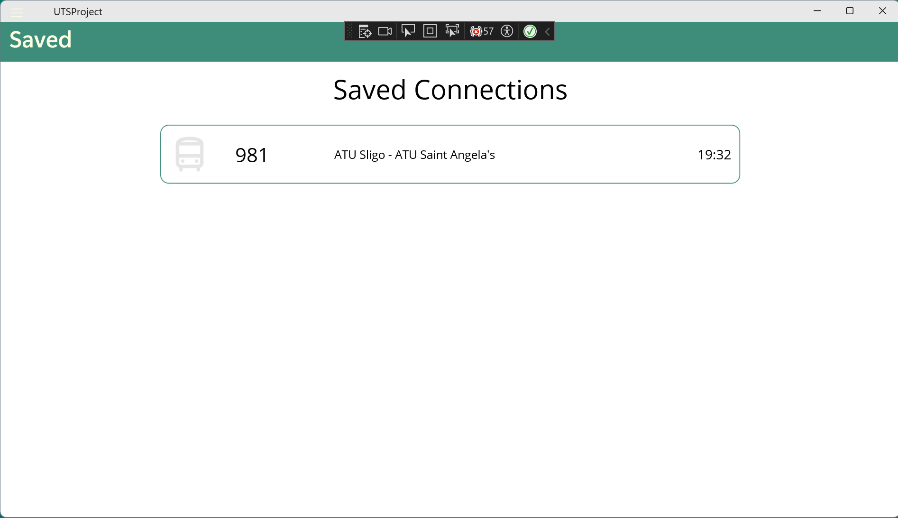

# UTSProject - Public Transport App for Ireland
## Installation
As for now the whole solution for Visual Studio exist as three seperate projects. The UTSProject, UTSProject.Test and UTSProject Database. These projects will be available in their seperate github repos soon enough. Currently, I only provide zipped file containing all of these projects for marking purposes only.
### Database Import
In order to use the application it is required to import a NTADatabase projetc included in the zipped file. The guide on how to do this is described in the Microsoft documentation: [SQLServer - Getting Started With SQL projects](https://learn.microsoft.com/en-us/sql/tools/sql-database-projects/get-started?view=sql-server-ver16&pivots=sq1-visual-studio). After importing the database into your local sql server you need to change the connection string in the Services/DbService file for the new connection string of the imported database. 
## Introduction
The goal of this project was to create a better working app for public transport using .NET MAUI framework. Most of the apps available on the market today are not intuitive and easy to use. They are often made for specific vendors which makes every app different resulting in lacking coherence. Project tries to mitigate these problems and brings new, easy-to-use interface for the user. 
*\*App is in early stage of development and will continue to be worked on*
## APIs and Services
Thanks to the NTA (National Transport Authority) we get unrestricted access to real-time data [Creative Commons Attribution (CC-BY) Licence](https://creativecommons.org/licenses/by/4.0/legalcode) about connections and vehicles that are registered under NTA. Unfortunately, the real-time data API heavily relies on static data that are NOT STORED IN A DATABASE or at least the access to this database is not publicly available. This fact lead me to create an entirely new database based on the static files to allow smooth integration of the API.
## Functionality
In this stage, user can :
- Choose the time and date of the search (search is limited to ATU Sligo)
- View all matching connections 
- View details of those connections
- Save connections (Only works until you refresh the page)
- Remove connections
### Screenshots 
Main Page

Connections Page

Connection Details 

Saved Connections

## Resources
This project uses following resources:
- API/Data
    - [NTA public API providing real-time data](https://developer.nationaltransport.ie/) ([License](https://data.gov.ie/pages/opendatalicence))
    - [Public Transport Schedules and Stops static data/files](https://developer.nationaltransport.ie/) ([License](https://data.gov.ie/pages/opendatalicence))
- Icons and Images
    - [Dazzle Line Icons Collection](https://www.svgrepo.com/collection/dazzle-line-icons/) ([License](https://www.svgrepo.com/page/licensing/#CC%20Attribution))
## Improvements for the future
At its current state the app is very plain with no real functionality other than displaying and saving temporary data. However as this is a very ambitious project of mine I will continue to improve this app to a state where it will be able to substitute all existing public transport apps made for Ireland. 
Improvements include:
- Mapping real-time data to the static ones
- Making the UI more advanced 
- Add more features (Select the shortest route, caching data, buying tickets,...)
- Optimization
- If required, create new API for static files and host it on the cloud